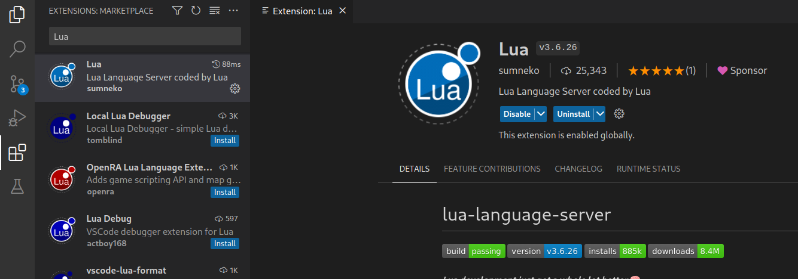
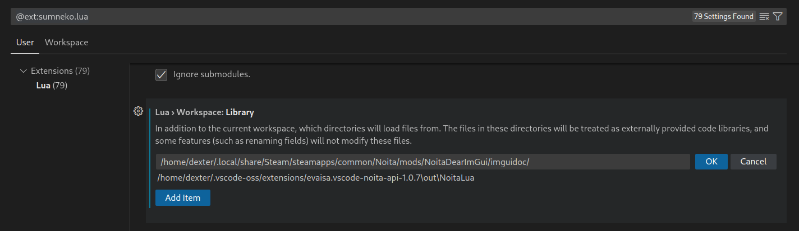
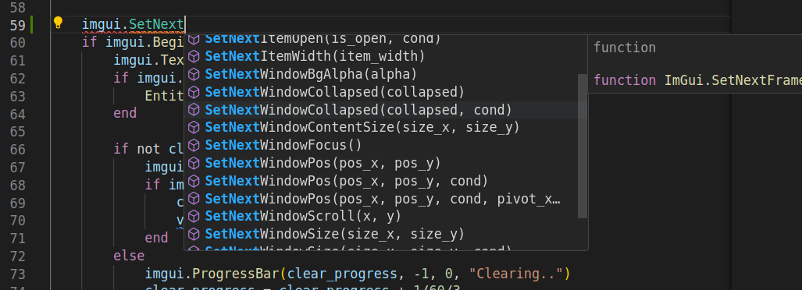

# Noita Dear ImGui bindings

## How to use this in your own mod?

You are not expected to bundle this mod with your own mod, you should instead
instruct people to install this themselves alongside your mod.

Any mod below this mod in the load order can use the ImGui bindings. This mod requires 'unsafe' mode,
but mods that use the ImGui bindings don't need unsafe mode themselves.

Make sure to occassionally switch the build type to 'Debug (for devs)' during development or if the game starts crashing. This often helps identify mistakes in use of the bindings.

Also check out the ImGui FAQ: https://github.com/ocornut/imgui/blob/master/docs/FAQ.md
a lot of stuff there also applies to these bindings.

## Documentation

There's generated [documentation containing all the function signatures](imguidoc/imgui_definitions.lua).

You can just refer to this file manually, but it's also possible to load into VS Code or any other editor that supports the [LuaLS/Lua Language Server](https://github.com/LuaLS/lua-language-server).

VS Code is pretty easy to setup:

1. Get the Lua language server extension. https://marketplace.visualstudio.com/items?itemName=sumneko.lua
   
2. Go into the extension's settings and add the `imguidoc` directory. This is included in the mod release zip.
   
3. It should now be working. Press ctrl+space to trigger autocomplete.
   

### Bindings

The bindings are a relatively close 1:1 mapping of the normal ImGui functions except:

- References are used in ImGui to pass data in and alter it. Lua doesn't have
  references so this is turned into by-value arguments and additional return
  values.

- Most structures are broken up into individual elements. So instead of a
  `ImVec2 size` argument, these bindings will accept two arguments `size_x`,
  `size_y`.

- ImGui's `Begin`/`BeginChild` functions have an inconsistency that's explained
  [here](https://github.com/dextercd/Noita-Dear-ImGui/blob/037d4a8bad1fc976f8dd731067fdc312a986f747/src/lua_features/imgui_windows.cpp#L6-L12).
  This inconsistency is fixed in the bindings.

- Enums don't have the `ImGui` prefix since you already have to use them through
  the `imgui` table.

This standard ImGui code:

```cpp
ImGui::ColorEdit3("Color", (float*)&color,
    ImGuiColorEditFlags_PickerHueWheel | ImGuiColorEditFlags_NoSidePreview | ImGuiColorEditFlags_NoAlpha);
```

turns into this with these Noita/Lua bindings:

```lua
_, r, g, b = imgui.ColorEdit3("Colour", r, g, b,
    bit.bor(imgui.ColorEditFlags.PickerHueWheel, imgui.ColorEditFlags.NoSidePreview, imgui.ColorEditFlags.NoAlpha))
```

## Example mod

There's an example mod that shows the basics: https://github.com/dextercd/Noita-Dear-ImGui/blob/main/ExampleMod/init.lua


## Credit

Many thanks to 🌸Rain🌸 (vexx32) on the Noita Discord for the Noita font ttf that she created:
    [Discord message](https://discord.com/channels/453998283174576133/626791912443084801/794756926722277377)
    ([Download](https://cdn.discordapp.com/attachments/626791912443084801/794756926973411338/NoitaPixel.ttf)).

- This repo hosts a slightly altered version with '{', '}', and '~' characters added.

Thanks to Kaedenn for creating the initial documentation using [this script](https://github.com/Kaedenn/noita/blob/main/tools/imgui_parse_api.py) he made.
